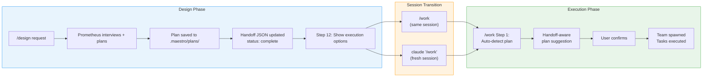
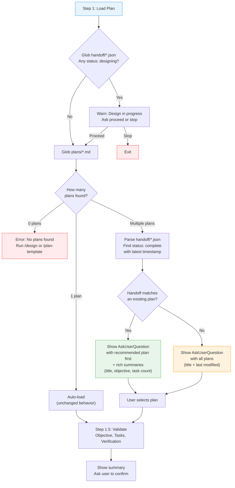
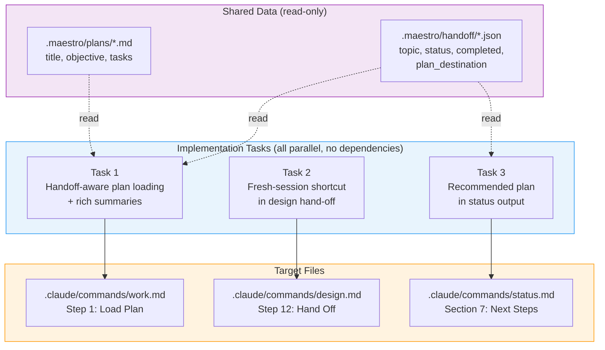

# Work Plan Autoload

## Diagrams

### End-to-End Workflow: Design to Execution



### /work Step 1: Plan Loading Decision Flow



### Task Structure and File Targets



## Objective
Enhance the `/work` command to intelligently suggest the most recently designed plan using handoff metadata, show richer plan summaries during selection, and guide users toward a clean-context execution workflow via `claude "/work"`.

## Scope

**In**:
- Modify `/work` command (`.claude/commands/work.md`) Step 1 to use handoff metadata for smart plan suggestion
- Add handoff-aware plan prioritization (most recently completed design first)
- Improve plan selection UX with richer summaries (objective, task count, design date)
- Add "recommended plan" indicator when a recent handoff exists
- Update `/design` command Step 12 hand-off message to suggest `claude "/work"` for fresh-session execution
- Update `/status` command to show clearer "ready to execute" guidance with the specific plan name

**Out**:
- Changes to plan format or structure
- Adding new agent definitions
- Changes to the design workflow (beyond Step 12 hand-off message)
- New runtime state files or directories
- Changes to handoff JSON schema (no new fields -- use existing metadata)
- Changes to `/reset`, `/review`, or `/plan-template` (review.md has a similar multi-plan selection but changing it is scope creep)
- Implementing hook scripts (all 4 hook scripts are stubs; this plan doesn't change that)
- UI/frontend changes (this is a prompt-only plugin)

## Tasks

- [ ] Task 1: Enhance `/work` Step 1 with handoff-aware plan loading
  - **File**: `.claude/commands/work.md`
  - **Description**: Rewrite Step 1 ("Load Plan") to cross-reference `.maestro/handoff/*.json` files when discovering plans. Currently, Step 1 already globs handoff files (line 33) but only checks for `status: "designing"` to warn the user. The enhancement adds a second use of handoff data: using `status: "complete"` handoffs to recommend a plan. Specifically:
    1. Keep the existing `status: "designing"` warning logic unchanged
    2. After globbing plans, if **multiple plans** are found, also parse all handoff files
    3. Find the handoff with `status: "complete"` and the latest `completed` timestamp
    4. If that handoff's `plan_destination` matches an existing plan file, present it as the recommended option:
       ```
       AskUserQuestion(
         questions: [{
           question: "Which plan would you like to execute?",
           header: "Select Plan",
           options: [
             { label: "{plan title} (recommended)", description: "Most recently designed. {objective excerpt}. {N} tasks." },
             { label: "{other plan title}", description: "{objective excerpt}. {N} tasks." },
             ...
           ],
           multiSelect: false
         }]
       )
       ```
    5. If multiple plans exist but no handoff files match, fall back to current behavior (list all plans with title + last modified, ask user to pick)
    6. If 0 or 1 plans found, keep current behavior unchanged
  - **Acceptance criteria**:
    - Step 1 parses handoff files for `status: "complete"` when multiple plans exist
    - Most recently completed design is listed first with "(recommended)" label
    - Each plan option shows title, objective excerpt, and task count
    - User can still choose any plan from the list
    - Behavior is unchanged when 0 or 1 plans exist
    - Behavior is unchanged when no handoff files exist (graceful degradation)
    - The existing `status: "designing"` warning is preserved unchanged
  - **Agent**: spark (single-file change to work.md)

- [ ] Task 2: Update `/design` hand-off message with fresh-session shortcut
  - **File**: `.claude/commands/design.md`
  - **Description**: Modify Step 12 ("Hand Off") to include guidance about starting a fresh session for execution. The current message (lines 277-282) just says "Run `/work`". Replace it with:
    ```
    Plan saved to: .maestro/plans/{topic}.md

    To begin execution:
      Option A (this session): /work
      Option B (fresh session): claude "/work"

    The /work command will auto-detect this plan and suggest it for execution.
    ```
    This leverages the Claude Code CLI's positional `[prompt]` argument, which starts a new session with `/work` auto-executing -- giving the user a clean context with the plan auto-loaded. The `claude "/work"` command is a real, working CLI invocation (verified via `claude --help`).
  - **Acceptance criteria**:
    - Step 12 output includes both in-session and fresh-session options
    - Fresh-session option shows `claude "/work"` as a copy-pasteable command
    - Message mentions that `/work` will auto-detect the plan
    - No changes to any other design steps
  - **Agent**: spark (single-file change to design.md)

- [ ] Task 3: Update `/status` to show recommended next plan
  - **File**: `.claude/commands/status.md`
  - **Description**: Enhance the "Next Steps" section (Section 7) to be more specific when a recently completed design exists. The current table (line 71) shows a generic suggestion: `"Ready to execute. Run /work to start."` when plans exist and no active tasks are running. Enhance this to cross-reference handoff files:
    1. When showing "Plans exist + no active tasks", also check handoff files for the most recently completed design
    2. If a matching handoff + plan pair exists, show: `"Ready to execute: {plan title}. Run /work to start, or claude "/work" for a fresh session."`
    3. If no handoff match, keep the generic suggestion
  - **Acceptance criteria**:
    - Status shows specific plan name in "Ready to execute" suggestion when handoff metadata is available
    - Includes `claude "/work"` fresh-session hint
    - Falls back to generic message when no handoff metadata is available
  - **Agent**: spark (single-file change to status.md)

## Verification

- [ ] Read `.claude/commands/work.md` Step 1 and confirm it parses handoff files for `status: "complete"` (not just `"designing"`)
- [ ] Confirm the `AskUserQuestion` options include "(recommended)" label for the handoff-matched plan
- [ ] Confirm each plan option shows title, objective excerpt, and task count
- [ ] Confirm graceful degradation: no handoff files = same behavior as before (title + last modified only)
- [ ] Confirm the existing `status: "designing"` warning is preserved unchanged in Step 1
- [ ] Read `.claude/commands/design.md` Step 12 and confirm it shows both `/work` and `claude "/work"` options
- [ ] Read `.claude/commands/status.md` Section 7 and confirm it cross-references handoff files for the plan name
- [ ] Run `./scripts/validate-links.sh` -- no broken links introduced
- [ ] Run `./scripts/validate-anchors.sh` -- no broken anchors introduced

## Notes

### Research Findings

1. **`claude "/work"` -- the fresh-session shortcut**: The Claude Code CLI accepts an initial prompt as a positional argument (`claude [prompt]`). Running `claude "/work"` starts a brand-new session with a clean context and immediately executes the `/work` command. Combined with the handoff-aware plan suggestion in Task 1, this gives users a seamless design-to-execution transition: design finishes, user copies the suggested command, and a fresh session starts with the right plan auto-detected.

2. **No programmatic context clearing**: Claude Code has `--continue` (resume last session) and `--resume` (resume by ID), but no mechanism to clear context within an active session. The `claude "/work"` approach sidesteps this by starting a new process entirely.

3. **Hooks are all stubs**: All 4 hook scripts (`orchestrator-guard.sh`, `plan-protection.sh`, `verification-injector.sh`, `plan-validator.sh`, `wisdom-injector.sh`) are stubs that just `exit 0`. There is no `SessionStart` hook configured. Hooks cannot be relied upon for plan auto-loading. The command markdown is the only functional layer.

4. **CLAUDE.md loads automatically but should not be modified**: Claude Code loads `CLAUDE.md` at session start, but dynamically modifying it to inject plan context would be fragile and conflict with version control. The command-based approach (Step 1 of `/work`) is the right layer.

5. **Consistent plan discovery pattern across commands**: All commands that touch plans use `Glob(".maestro/plans/*.md")`. The `review.md` command has a nearly identical multi-plan selection flow to `work.md` but changing it is out of scope for this plan.

6. **Handoff schema is minimal but sufficient**: The handoff JSON has `topic`, `status`, `started`, `completed` (only when complete), and `plan_destination`. We do NOT need new fields -- the `completed` timestamp for sorting and `plan_destination` for matching are sufficient. The plan title and task count are read from the plan file itself, which keeps the handoff as a thin pointer.

7. **`.maestro/` is fully gitignored**: The entire `.maestro/` directory (including plans, handoffs, wisdom) is in `.gitignore`. All state is local-only, which is correct for runtime artifacts.

### Technical Decisions

1. **Merged Tasks 1+2 into a single task** -- The original plan had separate tasks for "handoff-aware loading" and "richer summaries." Since both modify the same section of `work.md` Step 1, they are now a single task to avoid coordination overhead and merge conflicts.

2. **Handoff files as the intelligence layer** -- Rather than inventing new metadata files or modifying the handoff schema, we leverage the existing `completed` timestamp and `plan_destination` fields to determine the recommended plan.

3. **Graceful degradation throughout** -- Every enhancement degrades gracefully:
   - No handoff files? Same behavior as today (title + last modified).
   - Handoff exists but plan deleted? Falls back to plan-only discovery.
   - Only 1 plan? Still loads automatically, no handoff check needed.
   - Handoff with `status: "designing"` only? Existing warning behavior unchanged.

4. **All tasks independent and parallelizable** -- Task 1 (work.md), Task 2 (design.md), and Task 3 (status.md) each touch a single, different file. All three can be assigned to separate spark workers for parallel execution.

### Rollback Strategy

All changes are to command markdown files (`.claude/commands/work.md`, `.claude/commands/design.md`, `.claude/commands/status.md`). Git revert of commits restores previous behavior. No runtime state changes, no schema changes.

### Key Files
- `.claude/commands/work.md` -- main target (Task 1: enhanced Step 1 with handoff-aware selection)
- `.claude/commands/design.md` -- hand-off message update (Task 2: `claude "/work"` shortcut)
- `.claude/commands/status.md` -- status suggestion update (Task 3: specific plan name)
- `.maestro/handoff/*.json` -- existing metadata that powers the intelligence (read-only, no changes)
