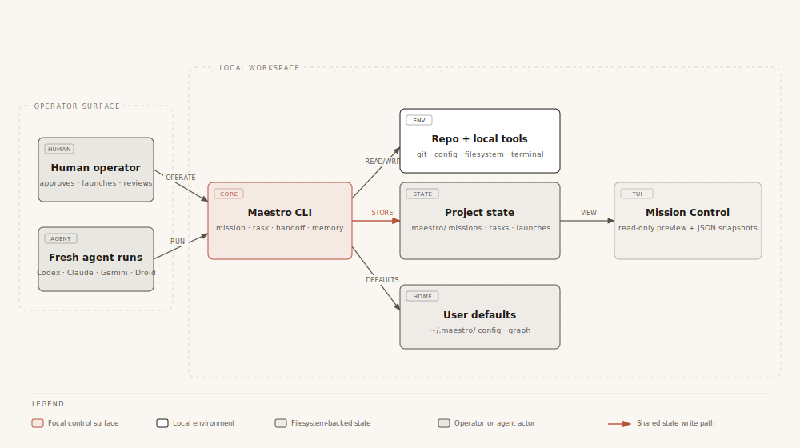
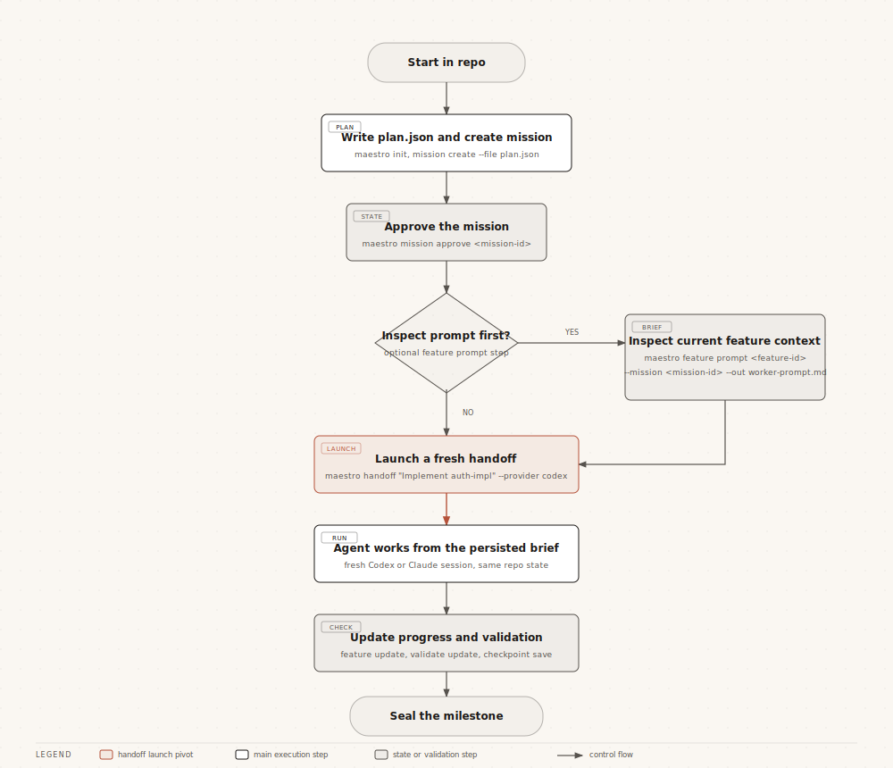
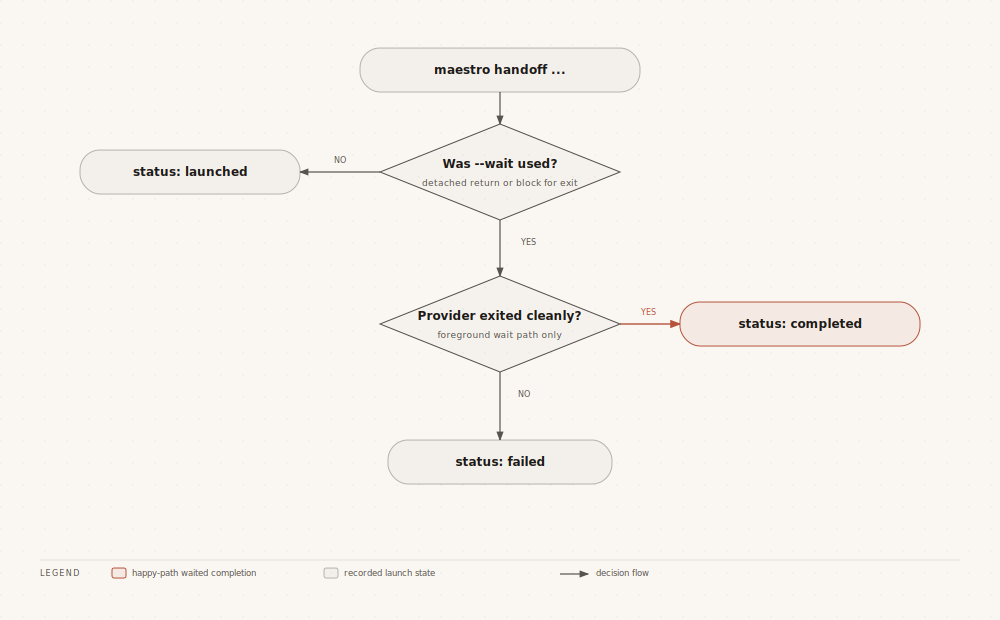
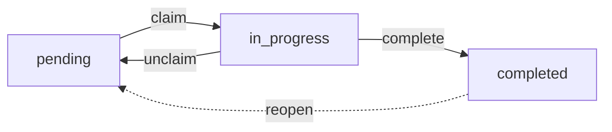
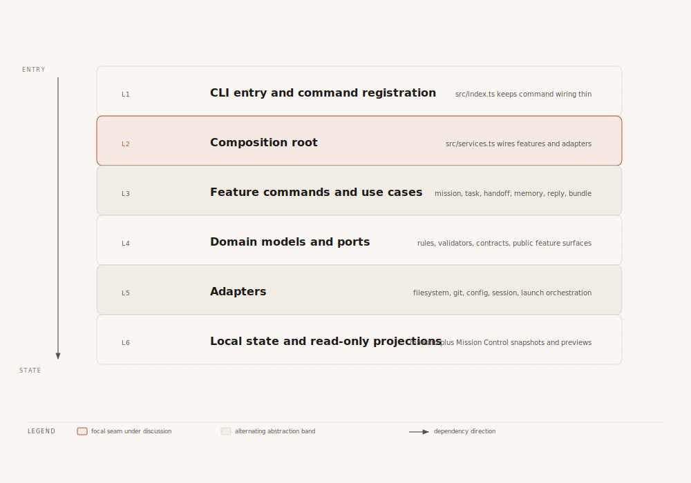

# maestro

Maestro is a local-first conductor for multi-agent software engineering. It gives you one CLI and one on-disk state model for missions, features, assertions, handoff launches, checkpoints, memory, and project context so separate agent sessions can collaborate without a server, database, or background daemon.

It is designed for a workflow where a human operator coordinates multiple terminals, while Maestro keeps the shared state disciplined and inspectable.

## Why Maestro

- Shared state lives on disk in `.maestro/`, not in chat history.
- Missions break work into milestones, features, and validation assertions.
- Native handoff launches build a self-contained markdown brief and start a fresh Codex or Claude run from the current repo state.
- Memory commands turn corrections and learnings into reusable guidance.
- Mission Control gives you a read-only TUI and JSON snapshots of current state.
- The runtime stays local-first: filesystem, git, config, and terminal tools.

## System Map



Maestro is the shared state layer in the middle. The operator and fresh agent runs both go through the CLI, the CLI persists shared state locally, and Mission Control projects that same state without mutating it.

## What Maestro Is Not

- It is not a hosted orchestration service or remote agent platform.
- It is not tied to a single model vendor or harness.
- It does not require a database, queue, or network API to work.

The human operator is the bridge between terminals. Maestro is the shared state layer underneath that workflow.

## Two Working Loops

Maestro has two related but separate operating modes:

| Use missions when you need... | Use tasks when you need... |
|---|---|
| A planned multi-step effort with milestones, assertions, checkpoints, and handoff launches. | A lightweight blocker graph for the daily queue. |
| A durable brief for a fresh agent run. | Fast `ready`, `claim`, `update`, and blocker management. |
| Reviewable artifacts under `.maestro/missions/<mission-id>/`. | Repo-tracked task state under `.maestro/tasks/tasks.jsonl`. |

If you only remember one distinction: `mission` is for planned execution; `task` is for the day-to-day queue.

## Core Concepts

| Concept | Purpose |
|---|---|
| Mission | The top-level unit of work with a lifecycle such as `draft`, `approved`, or `executing`. |
| Milestone | A phase within a mission. Milestones can act as work phases or validation gates. |
| Feature | A concrete piece of work assigned to an agent type, with verification steps and optional dependencies. |
| Assertion | A validation target tied to a feature. Assertions are updated to `passed`, `failed`, `blocked`, or `waived`. |
| Handoff | A persisted launch record plus markdown brief for starting a fresh Codex or Claude session from current mission or repo context. |
| Task | A Claude-style blocker-graph work item for the daily loop; lives at `.maestro/tasks/tasks.jsonl` independent of missions. |
| Reply | An agent's structured outcome record for a feature, optionally gated by behavioral principles. |
| Principle | A behavioral rule injected into agent prompts and scored against replies. Stored at `.maestro/principles.jsonl`. |
| Memory | Corrections, learnings, and compiled guidance that feed back into future agent prompts. |
| Checkpoint | A timestamped mission snapshot you can save and later restore. |
| Bundle | A portable `.mission.tar.gz` archive of a mission plus its artifacts for review or transfer. |
| Mission Control | A read-only dashboard for previewing mission state interactively or as JSON. |

## Mission Control Preview

Mission Control gives you a read-only terminal dashboard over the current Maestro state.


## How Work Flows



The loop is deliberately simple: define work, optionally inspect the feature brief, launch a fresh handoff, update progress, validate the outcome, and checkpoint before sealing the milestone.

## Installation

### Requirements

- [Bun](https://bun.sh/)
- Git
- A local agent harness in another terminal, such as Claude Code, Codex, Gemini CLI, or Droid CLI

### Install From Release

Install the latest published Maestro binary:

```bash
curl -fsSL https://raw.githubusercontent.com/ReinaMacCredy/maestro/main/scripts/install.sh | bash
```

Install a specific published release:

```bash
MAESTRO_VERSION=<version> curl -fsSL https://raw.githubusercontent.com/ReinaMacCredy/maestro/main/scripts/install.sh | bash
```

After installation, refresh to the latest published release with:

```bash
maestro update
```

### Build From Source

```bash
bun install
bun run build
```

This produces the compiled binary at `./dist/maestro`.

### Install Locally

```bash
bun run release:local
command -v maestro
maestro --version
```

If you also want to initialize global config and inject supported agent instruction blocks:

```bash
maestro install
```

`./dist/maestro` is the fresh repo build. `maestro` on your `PATH` is the installed local binary.

## Quick Start

### 1. Initialize a project

```bash
maestro init
```

This creates the local `.maestro/` workspace for the current repository.

### 2. Create a mission plan file

`mission create` expects a JSON plan file. A minimal example:

```json
{
  "title": "Add authentication",
  "description": "Ship the first authentication slice",
  "milestones": [
    {
      "id": "plan",
      "title": "Planning",
      "description": "Define the implementation approach",
      "order": 0,
      "kind": "work",
      "profile": "planning"
    },
    {
      "id": "implement",
      "title": "Implementation",
      "description": "Build and verify the feature",
      "order": 1,
      "kind": "work",
      "profile": "implementation"
    }
  ],
  "features": [
    {
      "id": "auth-plan",
      "milestoneId": "plan",
      "title": "Plan the auth flow",
      "description": "Define the login shape, risks, and acceptance criteria",
      "agentType": "codex-cli",
      "verificationSteps": [
        "Review the proposed flow with the team"
      ]
    },
    {
      "id": "auth-impl",
      "milestoneId": "implement",
      "title": "Implement the auth flow",
      "description": "Build the first working authentication slice",
      "agentType": "codex-cli",
      "dependsOn": [
        "auth-plan"
      ],
      "verificationSteps": [
        "Run build",
        "Run targeted tests",
        "Verify the login flow manually"
      ],
      "fulfills": [
        "auth-login-works"
      ]
    }
  ]
}
```

### 3. Create and approve the mission

```bash
maestro mission create --file plan.json
maestro mission list
maestro mission approve <mission-id>
```

### 4. Inspect the current feature brief (optional)

```bash
maestro feature list --mission <mission-id>
maestro feature prompt <feature-id> --mission <mission-id> --out agent-prompt.md
```

This writes the prompt to `agent-prompt.md` and also stores it under `.maestro/missions/<mission-id>/agents/<feature-id>/prompt.md`. `maestro handoff` does not require this step, but it is useful when you want to inspect the current feature context before launching a fresh agent run.

### 5. Launch a handoff

Launch a fresh Codex run for the next implementation slice:

```bash
maestro handoff \
  "Implement auth-impl for mission <mission-id> and run the listed verification steps before stopping" \
  --agent codex
```

Launches are detached by default. Maestro persists the handoff under `.maestro/launches/<id>/` and returns the launch record with the prompt path, log path, target directory, linked task id, and agent details.

Useful variants:

```bash
maestro handoff "Review auth-impl before merge" --agent claude --worktree auth-review
maestro handoff "Finish auth-impl and wait for the result" --agent codex --wait --json
maestro handoff pickup --id <handoff-id> --json
```

### 6. Track progress, validate, and seal

```bash
maestro feature update auth-impl --mission <mission-id> --status in-progress
maestro feature update auth-impl --mission <mission-id> --status review
maestro validate show --mission <mission-id>
maestro validate update auth-login-works --mission <mission-id> --result passed --evidence "bun test"
maestro checkpoint save --mission <mission-id>
maestro milestone seal implement --mission <mission-id>
```

## Handoffs

`maestro handoff "<task>"` builds a self-contained markdown brief from the current repo state plus the linked task continuation, then launches a fresh Codex or Claude run. Every launch is persisted under `.maestro/launches/<id>/` so the operator can inspect exactly what was sent and what the child process printed. `maestro handoff pickup` consumes one open packet and immediately takes over the linked task.

### What a launch contains

A launch record always includes:

- `id`, `agent`, and `model`
- `status`: `launching`, `launched`, `completed`, or `failed`
- `targetDir`: the directory handed to the external agent
- `promptPath`, `outputPath`, and the exact launched `command`
- task and takeover metadata such as `refs.taskId`, `createdByAgent`, `pickedUpByAgent`, and `consumedAt`
- optional `worktree` metadata when `--worktree` is used
- optional `pid` and `exitCode`, depending on detached vs `--wait` mode

The prompt itself is stored separately as markdown. Maestro always renders the same sections:

- `Task`
- `Context`
- `Relevant Files`
- `Current State`
- `What Was Tried`
- `Decisions`
- `Acceptance Criteria`
- `Constraints`

### How prompt context is chosen

- If exactly one actionable feature exists in the active mission, Maestro anchors the brief to that mission, milestone, feature, assertions, agent prompt or report artifacts, and the current git state.
- Otherwise it falls back to repository context: current branch, recent commits, and changed files.
- If the handoff is linked to an active task continuation, Maestro injects the saved `currentState`, `nextAction`, active decisions, and recent local timeline into the prompt before launch.
- When `--worktree` is used, Maestro creates the sibling worktree first and appends that worktree path and branch information to the `Constraints` section.

### Launch status flow



- Default mode returns as soon as the child process is started and records status `launched`.
- `--wait` blocks until the agent exits and records `completed` or `failed`.
- `--json` prints the persisted launch record for automation or debugging.
- `handoff pickup` atomically consumes a packet on first pickup and records the new active agent on the linked task continuation.

### Typical commands

Default Codex launch:

```bash
maestro handoff \
  "Implement auth-impl for mission <mission-id> and verify the touched surface area" \
  --agent codex
```

Claude launch in a sibling worktree:

```bash
maestro handoff \
  "Review auth-impl for regressions and missing tests" \
  --agent claude \
  --worktree auth-review
```

Foreground automation-friendly launch:

```bash
maestro handoff \
  "Finish auth-impl and return only after the tests pass" \
  --agent codex \
  --wait \
  --json
```

Use `--model` to override the agent default (`gpt-5.4` for Codex, `opus` for Claude), `--name` to label the launch, and `--base` when you need a specific base branch for a worktree handoff. Use `maestro handoff pickup` to consume a packet and immediately take over its linked task.

## Task System

Tasks are Maestro's lightweight, mutable issue graph for the daily queue. A task answers "what do I do next?"; a mission answers "what are we building?" Tasks live in `.maestro/tasks/tasks.jsonl`, are repo-tracked, and review like regular diffs.

### Lifecycle



- `pending` tasks sit in the queue.
- `in_progress` tasks are claimed by exactly one session.
- `completed` tasks are locked; edits or re-runs require `task reopen`, which restores the task and its continuation summary.
- Legacy statuses (`open`, `blocked`, `deferred`, `closed`) still parse from older state files and collapse to `pending` or `completed` on read.

Every task carries a `type` (`task`, `bug`, `feature`, `epic`, `chore`), a `priority` (`P0`-`P4`, default `P2`), freeform `labels`, optional `parentId`, ownership metadata (`assignee`, `claimedAt`, `lastActivityAt`), optional `contractId`, and an optional `receipt` (`summary`, `surprise`, `verifiedBy`) captured at completion.

### Dependencies and blocking

Blocking is symmetric and stored on both sides. Each task has a `blockedBy` list of prerequisites and a `blocks` list of dependents. Declaring that `A` blocks `B, C` atomically updates all three tasks.

```bash
maestro task block <id> <blockedTaskIds...>
maestro task unblock <id> <blockedTaskIds...>
maestro task create "..." --blocked-by <ids>
```

Rules enforced by the domain layer:

- A task is **ready** only when every entry in its `blockedBy` is `completed` (or missing from the store). `task ready` returns exactly the pending, unblocked, unassigned set, ranked `P0`/`P1` first and then by creation time.
- Status moves into `in_progress` or `completed` fail with a blocker error when any prerequisite is still open.
- The retired `task deps add|remove` verbs now error and point to `task block` / `task unblock`.

### Discovery

| Command | Returns |
|---|---|
| `maestro task ready` | Pending, unblocked, unassigned tasks, `P0`/`P1` first. |
| `maestro task mine` | Tasks claimed by the active session. |
| `maestro task stuck` | `in_progress` tasks idle past `--older-than` (default `4h`). |
| `maestro task similar <id>` | Tasks that look alike by title, completion reason, receipt text, and linked contract text. |
| `maestro task list` | Full filter set: `--status`, `--priority`, `--type`, `--label`, `--parent`, `--assignee`, `--limit`. |

### Ownership and claim

Claiming is exclusive and session-scoped. Session IDs come from the `sessionDetection` config (Claude Code out of the box) or `--session <id>` when scripting.

```bash
maestro task claim <id>
maestro task claim <id> --busy-check        # refuse if this session already owns open work
maestro task claim <id> --force             # steal from another session
maestro task claim <id> --stale-after 4h    # auto-release a dead owner's stale claim
maestro task unclaim <id>                   # in_progress demotes to pending
maestro task release-owned <sessionId>      # release everything a session held
maestro task heartbeat <id>                 # bump lastActivityAt without other edits
```

`task update <id> --status in_progress` auto-claims an unassigned task for the current session, provided the session has no other open work (or `--force` is passed). This preserves the invariant that a session owns at most one in-flight task at a time.

### Batch planning

Agents can stage a whole queue upfront from one JSON file. References between tasks use a batch-local `name` slot that resolves to real ids inside a single atomic write.

```bash
maestro task plan --file plan.json
maestro task plan --file - < plan.json
maestro task plan --file plan.json --start scaffold    # auto-claim the named task
maestro task plan --file plan.json --dry-run           # validate without writing
```

```json
{
  "batchId": "auth-slice",
  "tasks": [
    { "name": "scaffold", "title": "Scaffold auth module", "type": "chore", "priority": 2 },
    { "name": "tests", "title": "Add login tests", "blockedBy": ["scaffold"] },
    { "title": "Wire login route", "blockedBy": ["scaffold", "tests"], "labels": ["auth"] }
  ]
}
```

### Resumable continuation

Every task has a durable, on-disk continuation record that tells the next agent where work stands. It is the source of truth for resume across sessions, across agents, and across context compaction. Standalone handoff packets are the transfer artifact; the continuation is the state.

Two files back each task:

- `.maestro/tasks/continuations/active/<taskId>.json` -- live summary. Moves to `completed/<taskId>.json` at `task update --status completed` and returns to `active/` on `task reopen`.
- `.maestro/tasks/local-history/<taskId>.jsonl` -- append-only event log (per-machine).

Summary fields: `currentState`, `nextAction`, `keyDecisions`, `activeAgent`, `lastActiveAt`. Event kinds: `snapshot`, `decision`, `next_action_set`, `blocker_set`, `handoff_created`, `handoff_picked_up`, `agent_takeover`, `task_completed`, `task_reopened`.

#### Three ways work resumes

1. **Same session, chat intent.** Maestro installs Claude Code hooks that hydrate the active continuation into the agent's context with no CLI call:
   - `SessionStart` injects a short pointer when an active task exists: id, title, status, last-active timestamp, and a nudge to say `continue` or `resume`.
   - `UserPromptSubmit` watches for these exact phrases (case- and punctuation-insensitive) and expands them into the full resume payload (current state, next action, active decisions, recent timeline) before the model sees the prompt:
     - `continue`
     - `continue work`
     - `resume`
     - `resume work`
     - `pick up where we left off`
     - `resume where we left off`
     - `resume from where we left off`
   - `PreCompact` preserves the continuation in the compacted summary so resume survives a context reset.

   These are plain chat intents, not Maestro CLI commands.

2. **Different agent, handoff pickup.** `maestro handoff pickup [--id <handoffId>]` consumes one open packet atomically, force-claims the linked task for the current session, moves it to `in_progress`, transfers any contract ownership, rewrites the continuation summary with a `Resumed from handoff ...` prefix, and records `agent_takeover` + `handoff_picked_up` events. The new agent inherits the prior `nextAction` and `keyDecisions` without a separate chat intent.

3. **Manual inspection.** `maestro task show <id>` prints the raw task and continuation state for offline review.

#### Keep the continuation fresh while working

```bash
maestro task update <id> \
  --current-state "Tests pass locally; rebased on main" \
  --next-action "Open PR and request review" \
  --add-decision "Use bcrypt over argon2 for parity with legacy" \
  --remove-decision "Use JWTs in localStorage"
```

Refresh when current state or next action changes, when a load-bearing decision or constraint changes, or when blockers appear or clear.

### Contracts

A contract is a machine-checked agreement attached to a task: what to touch, what to avoid, and what "done" means. At completion, Maestro diffs `claimedAtCommit..HEAD` and renders a verdict.

Lifecycle: `draft` -> `locked` or `amended` -> `fulfilled` or `broken`, with `discarded` as an early-exit from `draft`. A closed contract can be reopened alongside its task.

```bash
maestro task contract new <taskId> --editor "$EDITOR"   # or --from template.yaml
maestro task contract edit <ref>
maestro task contract lock <ref>                         # freeze scope + claim commit
maestro task contract amend <ref>                        # record a post-lock change
maestro task contract show <ref>
maestro task contract list
maestro task contract verdict <ref>                      # preview without closing
maestro task contract discard <ref>                      # draft only
maestro task contract reopen <ref>                       # after fulfilled/broken
maestro task contract criteria mark <ref> <criterionId> --evidence "bun test"
maestro task contract criteria add <ref> "New criterion text"
maestro task contract criteria remove <ref> <criterionId>
```

A contract records:

- `intent` -- one-sentence goal.
- `scope` -- `filesExpected`, `filesForbidden`, optional `maxFilesTouched` cap.
- `doneWhen[]` -- explicit criteria, each `manual` or `receipt-hint`, each markable with evidence.
- `claimedAtCommit` -- git HEAD captured at lock; the verdict diffs against it.
- `configSnapshot` -- strictness, overlap policy, anchor-rebase fallback, and stale-reclaim policy in effect at lock time.
- `ownershipHistory` -- transfers from `claim --force` reclaims and `handoff pickup`.

Completion gating: `task update --status completed` against a task with a locked contract closes the contract, renders a verdict, and fails completion when the verdict is broken and either `contracts.strict=true` is set or `--strict` is passed. Use `--no-contract` to complete without a contract when `contracts.default=required`.

Relevant config (`.maestro/config.yaml`):

```yaml
contracts:
  default: prompt              # required | prompt | optional
  strict: false                # block completion on broken verdict
  overlapPolicy: fail          # fail | annotate (active contract scope overlap)
  rebaseFallback: best-effort  # best-effort | fail (when claimedAtCommit is missing)
  defaultMaxFilesTouched: ~    # integer cap or unset
  staleReclaimContractPolicy: inherit  # inherit | block (when taking over a stale claim)
```

### Task storage

```text
.maestro/tasks/
├── tasks.jsonl                 # authoritative task graph (repo-tracked)
├── contracts/                  # per-task locked contracts and verdicts (repo-tracked)
├── contract-templates/         # reusable YAML drafts for `contract new --from`
├── continuations/              # per-task resume summaries + event logs
├── batches/                    # batch plan manifests
├── candidates/                 # captured work candidates awaiting promotion
└── local-history/              # per-machine audit log (ignored)
```

`tasks.jsonl`, `contracts/`, and `principles.jsonl` are intentionally repo-tracked so the queue and its policies review like any other code change. Local histories and candidate piles stay per-machine. Bound their growth with:

```bash
maestro task prune                       # keep the most recent 500 entries per kind
maestro task prune --keep 100 --candidates-only
maestro task prune --continuations-only --dry-run
maestro task prune --all                 # purge both piles
```

## Common Commands

| Command | Use it when you want to... |
|---|---|
| `maestro init` | Create local project state. |
| `maestro install` | Initialize global config and inject supported agent instruction blocks. |
| `maestro update` | Upgrade the local binary to the latest release and refresh agent instruction blocks. |
| `maestro doctor` | Check whether the local environment is configured correctly. |
| `maestro status` | Inspect the current Maestro state quickly. |
| `maestro mission create --file plan.json` | Create a mission from a plan file. |
| `maestro feature prompt <feature-id> --mission <mission-id>` | Generate the next agent prompt. |
| `maestro feature update <feature-id> --mission <mission-id> --status <status>` | Advance a feature through `pending`, `assigned`, `in-progress`, `review`, `done`, or `blocked`. |
| `maestro reply write <feature-id>` | Record an agent reply (outcome + optional report) for a feature. |
| `maestro handoff "<task>" --agent <agent>` | Build a markdown brief from current repo or mission context and launch a fresh agent run. |
| `maestro handoff pickup [--id <handoff-id>]` | Consume one open handoff packet and immediately take over its linked task. |
| `maestro handoff "<task>" --worktree [slug] --wait --json` | Launch in a sibling worktree, wait for completion, and return structured metadata. |
| `maestro mission-control --preview` | Render a read-only dashboard preview in the terminal. |
| `maestro mission-control --json` | Get a machine-readable snapshot of mission state. |
| `maestro mission-control --render-check --size 120x40` | Validate TUI render integrity non-interactively. |
| `maestro task ready` | List actionable pending tasks with no unresolved blockers. |
| `maestro task claim <id>` | Take ownership of a task for the current session. |
| `maestro task update <id> --status in_progress` / `--status completed --reason "..."` | Start or finish a task. |
| `maestro task update <id> --current-state "..." --next-action "..." --add-decision "..."` | Refresh the resumable continuation summary for the next agent. |
| `maestro task reopen <id>` | Move a completed task back to the pending queue and restore its continuation summary. |
| `maestro task block <id> <blockedTaskIds...>` | Record that one task blocks others. |
| `maestro principle list` / `principle add` | Inspect or register a behavioral principle. |
| `maestro bundle export <mission-id> --out ./review.mission.tar.gz` | Package a mission + artifacts as a portable archive. |
| `maestro bundle inspect <path>` | Print a mission bundle's manifest without extracting. |
| `maestro memory-correct <rule>` | Capture a correction that should influence future runs. |
| `maestro memory-compile` | Turn raw learnings into reusable guidance. |
| `maestro ratchet-check` | Run the regression ratchet suite. |

Run `maestro <command> --help` for full flags and examples.

## Mission Control

Mission Control is a read-only dashboard over Maestro state. It supports:

- Interactive TTY mode with `maestro mission-control`
- Single-frame previews with `maestro mission-control --preview`
- Machine-readable snapshots with `maestro mission-control --json`
- Render validation with `maestro mission-control --render-check --size 120x40`

Available preview screens include:

- `dashboard`
- `features`
- `dependencies` (mission-only)
- `config`
- `memory`
- `graph`
- `agents`
- `dispatch` (mission-only)
- `events`
- `tasks`
- `timeline` (mission-only)
- `principles`
- `help`

Aliases: `feat`, `deps`, `cfg`, `mem`, `agent`, `event`, `task`, `principle`. Mission-only screens are skipped automatically when running in home mode.

For non-interactive environments, prefer `--preview`, `--preview all`, or `--json`.

## Architecture



The codebase follows a hexagonal shape: commands stay thin, `src/services.ts` wires dependencies, use cases depend on domain rules and ports, and adapters implement those ports against the local filesystem and environment.

## Storage Model

Maestro stores project-local state in `.maestro/` and user-level defaults in `~/.maestro/`.

| Surface | Lives where | Holds |
|---|---|---|
| Project workflow state | `.maestro/` | Missions, launches, tasks, notes, and local memory artifacts |
| User-level defaults | `~/.maestro/` | Global config and graph metadata |
| Read-only projections | Mission Control | Terminal previews and JSON snapshots over the same state |

```text
.maestro/
├── config.yaml
├── launches/
├── memory/
│   ├── corrections/
│   ├── learnings/
│   └── ratchet/
├── missions/
│   └── <mission-id>/
│       ├── mission.json
│       ├── assertions.json
│       ├── checkpoints/
│       ├── features/
│       └── agents/
├── tasks/
│   ├── tasks.jsonl
│   ├── contracts/
│   ├── contract-templates/
│   ├── continuations/
│   ├── batches/
│   ├── candidates/
│   └── local-history/
├── principles.jsonl
└── notes.json

~/.maestro/
├── config.yaml
└── graph/
    └── projects.json
```

The design is intentionally transparent: state is inspectable, diffable, and easy to back up. `.maestro/tasks/**` and `.maestro/principles.jsonl` are intentionally repo-tracked so the daily queue and behavioral rules are reviewed like any other code change; `.maestro/missions/**` and `.maestro/launches/**` stay ignored as local orchestration artifacts. Legacy `.maestro/handoffs/**` folders can remain on disk, but Maestro no longer reads them and `status` or `doctor` will warn when they are present.

## Codebase Layout

Maestro is organized as a feature-first hexagonal codebase:

- `src/features/<name>/` -- each feature is a bounded context containing its own `commands/`, `usecases/`, `domain/`, `ports/`, `adapters/`, plus a `services.ts` composition factory and `index.ts` public surface. Current features: `ratchet`, `handoff` (markdown prompt building plus Codex or Claude launch orchestration), `notes`, `graph`, `session`, `memory`, `mission` (with `feature/`, `validation/`, `checkpoint/` subfolders and behavioral principles), `agent` (library-only; composes agent prompts and manages harness config injection), `task` (Claude-style blocker graph for the daily loop), `reply` (agent reply ingest with principle gating), and `bundle` (portable mission archive).
- `src/infra/` -- plumbing that isn't a feature: init, doctor, status, install, update, uninstall, and mission-control commands, config and git ports/adapters, and infra-owned domain types.
- `src/shared/` -- generic utilities with no domain knowledge: filesystem, YAML, shell, path safety, and output formatting under `lib/`; cross-cutting primitives like IDs and UI config under `domain/`; plus top-level `errors.ts`, `version.ts`, and `version-format.ts`.
- `src/tui/` -- read-only rendering and input for Mission Control; consumes features through their public surfaces. See `src/tui/README.md` for the contributor-oriented TUI architecture walkthrough.
- `src/services.ts` -- composition root that wires every feature's adapters into a single service object.
- `src/index.ts` -- Commander CLI entry point.

Cross-feature imports must go through `@/features/<name>`, which resolves to the feature's `index.ts`. Deep imports across feature boundaries are forbidden and enforced by `bun run check:boundaries` in CI. Two features have explicit, scoped exceptions:

- `agent` may import from `mission`, `memory`, and `handoff` through their public surfaces, because agent composes prompts from mission context, memory hints, and the native handoff launcher APIs.
- `bundle` may import from `mission`, `reply`, `handoff`, and `session` through their public surfaces, because bundle is a read-only aggregator that snapshots every mission artifact, including handoff launches, into a portable archive.

The runtime is intentionally narrow: filesystem-backed stores, git integration, config handling, and a terminal UI. There is no database adapter or network service in the main workflow.

## Development

```bash
bun run build
bun run typecheck
bun test
bun run tui:dev
bun run release:local
```

Useful verification commands for CLI and TUI work:

```bash
./dist/maestro --version
maestro --version
maestro --help
maestro mission-control --preview --size 120x40 --format plain
maestro mission-control --render-check --size 120x40
```

## Supported Agent Config Injection

`maestro install` and `maestro update` can inject instruction blocks for:

- Claude Code
- Codex
- Gemini CLI
- Droid CLI

These instruction blocks help each harness read and write shared Maestro state consistently.

## License

MIT
